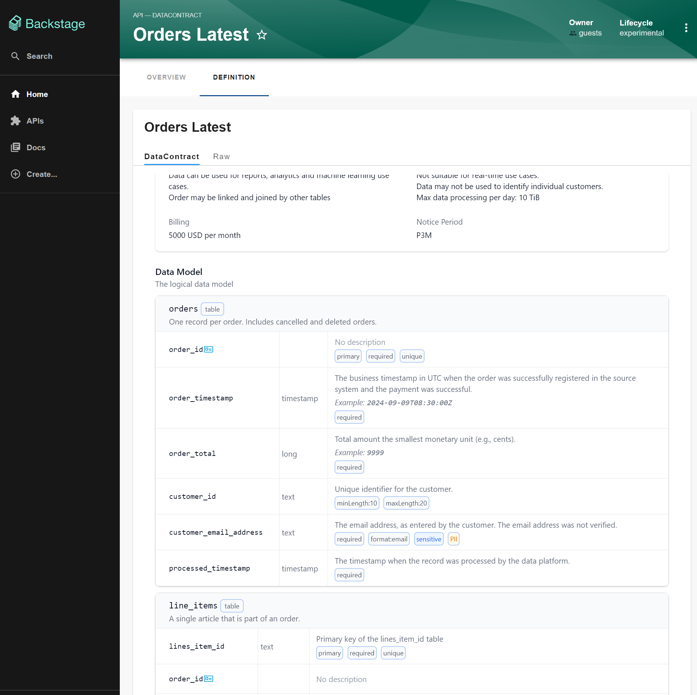

# DataContract Backstage Plugin

A Backstage plugin for managing and visualizing [DataContract](https://datacontract.com/) specifications within your service catalog. This plugin enables teams to document, validate, and share data contracts as API entities in Backstage.

## What is a DataContract?

DataContracts are specifications that define the structure, format, and semantics of data interfaces between services. They help teams:

- Document data schemas and formats
- Define data quality expectations
- Specify SLA requirements
- Establish data governance policies
- Enable data product management

This plugin integrates DataContract specifications into Backstage as API entities, providing a unified view of your data landscape alongside your services and components.

## Features

- **API Entity Integration**: Register DataContract specifications as API entities with `type: datacontract`
- **Schema Validation**: Automatic validation against the official [DataContract specification](https://github.com/datacontract/datacontract-specification)
- **Rich Visualization**: Custom widget for rendering DataContract details in a user-friendly format
- **File Reference Support**: Load DataContract definitions from external files using `$file:` references
- **Catalog Integration**: Full integration with Backstage's catalog system and entity model



## How It Works

### API Entity Structure

DataContracts are represented as Backstage API entities with the following structure:

```yaml
apiVersion: backstage.io/v1alpha1
kind: API
metadata:
  name: orders-api
  title: Orders Data Contract
  description: Customer orders data contract for the e-commerce platform
  owner: checkout-team
  tags:
    - data-contract
    - orders
    - ecommerce
spec:
  type: datacontract  # This identifies it as a DataContract
  definition: |
    dataContractSpecification: 0.9.2
    id: urn:datacontract:checkout:orders-latest
    info:
      title: Orders Latest
      version: 1.0.0
      description: |
        Successful customer orders in the webshop. 
        All orders since 2020-01-01.
        Updated daily via automated ETL.
      owner: checkout-team
      contact:
        name: John Doe
        email: john.doe@example.com
    servers:
      prod:
        type: s3
        location: s3://my-bucket/orders/{model}/*.json
        format: json
    models:
      orders:
        type: table
        description: Successful customer orders
        fields:
          order_id:
            type: string
            description: Primary key of the orders table
            required: true
            primary: true
            example: "O-123456"
          customer_id:
            type: string
            description: Unique identifier for the customer
            required: true
            example: "C-789012"
          order_total:
            type: number
            description: Total amount of the order in USD
            required: true
            example: 99.99
    quality:
      type: SodaCL
      specification: |
        checks for orders:
          - row_count >= 5
          - duplicate_count(order_id) = 0
```

### File References

You can also reference external DataContract files:

```yaml
apiVersion: backstage.io/v1alpha1
kind: API
metadata:
  name: orders-api
  title: Orders Data Contract
spec:
  type: datacontract
  definition: $file:./datacontract.yaml
```

## Installation

### Frontend Plugin Installation

1. **Install the frontend plugin:**

```bash
# From your Backstage root directory
yarn workspace app add @remunda/backstage-plugin-datacontract
```

2. **Add the plugin to your frontend app:**

In `packages/app/src/App.tsx`, import and configure the plugin:

```typescript
import {
  datacontractPlugin,
  withDatacontractApiDocsConfigFactory,
} from '@remunda/backstage-plugin-datacontract';
import { 
  defaultDefinitionWidgets,
  apiDocsConfigRef,
} from '@backstage/plugin-api-docs';

// Add to your app configuration
const app = createApp({
  apis: [
    // Add the DataContract API docs config factory
    withDatacontractApiDocsConfigFactory(defaultDefinitionWidgets()),
    // ... other API factories
  ],
  plugins: [
    // Add the datacontract plugin
    datacontractPlugin,
    // ... other plugins
  ],
});
```

### Backend Plugin Installation

1. **Install the backend plugin:**

```bash
# From your Backstage root directory
yarn workspace backend add @remunda/backstage-plugin-datacontract-backend
```

2. **Add the backend module to your backend:**

In `packages/backend/src/index.ts`:

```typescript
import { createBackend } from '@backstage/backend-defaults';

const backend = createBackend();

// Add the DataContract catalog module
backend.add(import('@remunda/backstage-plugin-datacontract-backend'));

backend.start();
```

3. **Configure catalog locations (optional):**

In your `app-config.yaml`, you can add locations that contain DataContract API entities:

```yaml
catalog:
  locations:
    - type: file
      target: ../../examples/datacontracts/*.yaml
    - type: url
      target: https://github.com/your-org/datacontracts/blob/main/catalog-info.yaml
```

## Usage

### Creating DataContract Entities

1. **Create a DataContract specification file** (e.g., `orders-datacontract.yaml`):

```yaml
dataContractSpecification: 0.9.2
id: urn:datacontract:checkout:orders-latest
info:
  title: Orders Latest
  version: 1.0.0
  description: Customer orders data contract
  owner: checkout-team
servers:
  prod:
    type: bigquery
    project: my-project
    dataset: orders_dataset
models:
  orders:
    type: table
    fields:
      order_id:
        type: string
        required: true
        primary: true
      customer_id:
        type: string
        required: true
      order_total:
        type: number
        required: true
```

2. **Create a Backstage catalog entity** (e.g., `catalog-info.yaml`):

```yaml
apiVersion: backstage.io/v1alpha1
kind: API
metadata:
  name: orders-data-contract
  title: Orders Data Contract
  description: Data contract for customer orders
  owner: checkout-team
  tags:
    - data-contract
    - orders
spec:
  type: datacontract
  definition: $file:./orders-datacontract.yaml
```

3. **Register the entity** by adding its location to your Backstage catalog or including it in your repository's `catalog-info.yaml`.

### Viewing DataContracts

Once registered, DataContract entities will appear in your Backstage catalog:

- Browse to **APIs** in the Backstage sidebar
- Filter by `Type: datacontract` to see all DataContract entities
- Click on any DataContract to view its detailed specification
- The custom DataContract widget will render the specification in a user-friendly format

### Example DataContract Entity

See the included [sample-datacontract.yaml](./sample-datacontract.yaml) for a complete example with all supported DataContract features.

## Configuration

### API Docs Integration

The plugin automatically extends Backstage's API documentation system. When viewing an API entity with `spec.type: datacontract`, the DataContract widget will be displayed instead of the default API documentation.

### Validation

The backend processor automatically validates all DataContract specifications against the official schema. Validation errors will appear in the Backstage catalog and prevent invalid entities from being processed.

## Development

For plugin development instructions, see the main repository [README](../../README.md).

## Support

- **Issues**: [GitHub Issues](https://github.com/remunda/backstage-plugins/issues)
- **Documentation**: [DataContract Specification](https://github.com/datacontract/datacontract-specification)
- **Backstage**: [Backstage Documentation](https://backstage.io/docs)

## License

This plugin is licensed under the same terms as the main repository.


